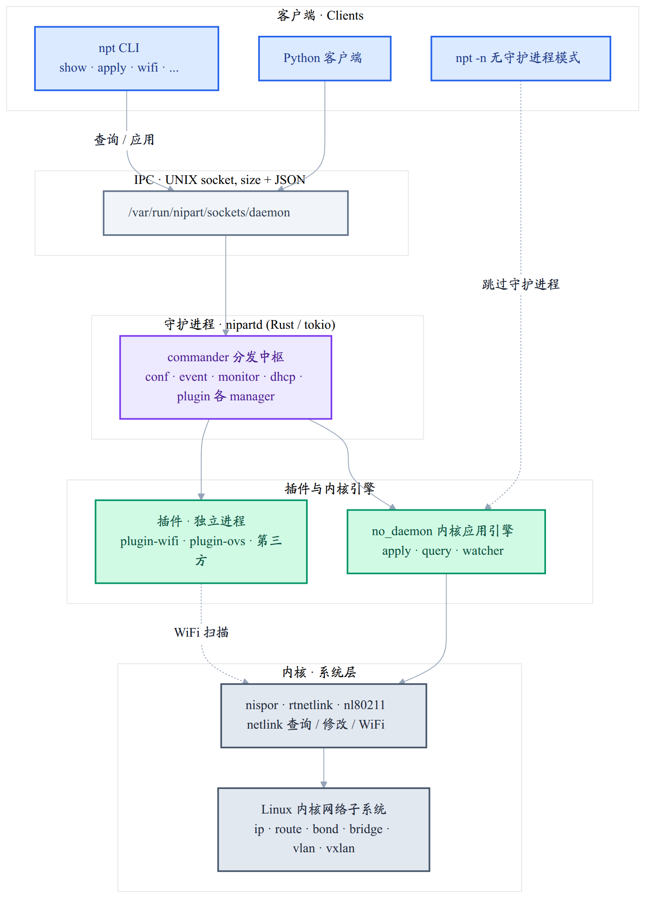

# 架构

Nipart 的整体架构由以下层级组成：

* **客户端层**：`npt` 命令行工具、Python 客户端，以及无守护进程模式
  (`npt -n`)。
* **IPC 层**：客户端与守护进程通过 UNIX socket 通信，数据格式为
  `size + JSON`。
* **守护进程** (`nipartd`)：基于 Rust / tokio，由 commander 统一分发命令
  给 conf / event / monitor / dhcp / plugin 等 manager。
* **插件层**：插件以独立进程运行，通过 UNIX socket 与守护进程通信，
  支持 WiFi、Open vSwitch 及第三方扩展。
* **内核引擎**：no_daemon 模块负责直接应用与查询内核网络状态，是守护
  进程模式和无守护进程模式共用的内核交互引擎。
* **内核层**：通过 nispor (查询)、rtnetlink / mozim (修改)、
  nl80211 (WiFi) 与 Linux 内核网络子系统交互。
