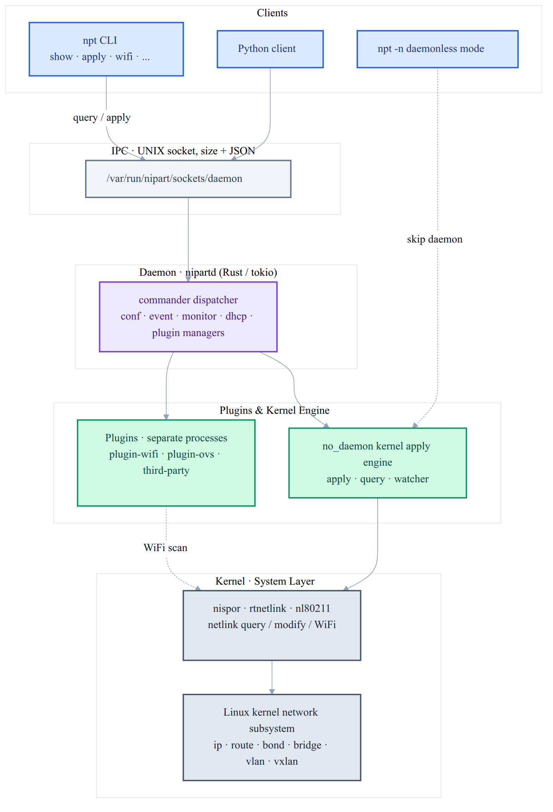

# Architecture

The overall architecture of Nipart consists of the following layers:

* **Clients**: the `npt` CLI, the Python client, and the daemonless mode
  (`npt -n`).
* **IPC layer**: clients talk to the daemon over a UNIX socket using
  `size + JSON` framing.
* **Daemon** (`nipartd`): built on Rust / tokio. A commander dispatches
  commands to the conf / event / monitor / dhcp / plugin managers.
* **Plugins**: run as separate processes communicating with the daemon
  over UNIX sockets, enabling WiFi, Open vSwitch, and third-party
  extensions.
* **Kernel engine**: the no_daemon module applies and queries kernel
  network state directly; it is the shared engine for both daemon and
  daemonless modes.
* **Kernel layer**: interacts with the Linux kernel network subsystem via
  nispor (query), rtnetlink / mozim (modify), and nl80211 (WiFi).
